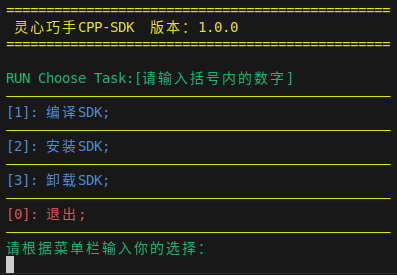

# LinkerHand-CPP-SDK

## 概述
LinkerHand-CPP-SDK 是灵心巧手科技有限公司开发，用于L10、L20等型号灵巧手的驱动软件和功能示例源码。

## 安装
#### 依赖环境
    sudo apt-get install yaml-cpp

#### 启动脚本
    cd linker_hand_cpp_sdk/linker_hand
    ./script.sh
    

#### 运行示例
    cd build
    ./linker_hand_example

## 快速开始

创建main.cpp文件，并添加以下代码：
```cpp
// main.cpp
#include "LinkerHandApi.h"

int main() {
    
    // 初始化机械手
    LinkerHandApi hand("right", "L10");

    // 获取版本信息
    std::cout << hand.getVersion() << std::endl;

    // 握拳
    std::vector<uint8_t> fist_pose = {101, 60, 0, 0, 0, 0, 255, 255, 255, 51};
    hand.fingerMove(fist_pose);
	std::this_thread::sleep_for(std::chrono::seconds(1));

    // 松手
    std::vector<uint8_t> open_pose = {255, 104, 255, 255, 255, 255, 255, 255, 255, 71};
    hand.fingerMove(open_pose);
	std::this_thread::sleep_for(std::chrono::seconds(1));
	
    return 0;
}
```
创建CMakeLists.txt文件，并添加以下配置：
```cmake
# CMakeLists.txt
cmake_minimum_required(VERSION 3.5)
project(MyProject)

# 包含目录
include_directories(/usr/local/linker_hand_cpp_sdk/include)

# 查找 liblinker_hand_lib.a 库
find_library(LINKER_HAND_LIB
    NAMES linker_hand_lib
    PATHS /usr/local/linker_hand_cpp_sdk/lib
    NO_DEFAULT_PATH
)

# 检查是否找到库
if(NOT LINKER_HAND_LIB)
    message(FATAL_ERROR "liblinker_hand_lib.a not found!")
else()
    message(STATUS "liblinker_hand_lib.a found at ${LINKER_HAND_LIB}")
endif()

# 添加可执行文件
add_executable(my_project main.cpp)

# 链接库
target_link_libraries(my_project ${LINKER_HAND_LIB} pthread)
```

#### 文件结构
```
├── example
│   ├── CMakeLists.txt
│   └── main.cpp
```
#### 编译
    cd example
    mkdir build
    cd build
    cmake ..
    make
#### 运行
    ./my_project


## API文档
[L10 C++ API文档](linker_hand/docs/API-Reference-L10.md)

[L20 C++ API文档](linker_hand/docs/API-Reference-L20.md)

## 版本更新
