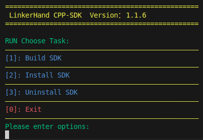

# LinkerHand-CPP-SDK

## 概述
LinkerHand-CPP-SDK 是灵心巧手科技有限公司开发，用于L10、L20等型号灵巧手的驱动软件和功能示例源码。

## 安装
#### 依赖环境
    sudo apt-get install yaml-cpp
    ...

#### 启动脚本
    cd linker_hand_cpp_sdk/linker_hand
    ./script.sh
    

#### 运行示例
    cd build
    ./linker_hand_example

## 快速开始

创建main.cpp文件，并添加以下代码：
```cpp
// main.cpp
#include "LinkerHandApi.h"

int main() {
    // 初始化机械手
    LinkerHandApi hand("right", "L10");

    // 设置关节位置
    std::vector<double> jointAngles = {1.0, 2.0, 3.0, 4.0, 5.0, 6.0};
    hand.setJointPositions(jointAngles);

    // 获取当前状态
    auto status = hand.getState();
    std::cout << "Current State: ";
    for (const auto& val : status) {
        std::cout << std::hex << (int)val << " ";
    }
    std::cout << std::endl;

    return 0;
}
```
创建CMakeLists.txt文件，并添加以下配置：
```cmake
# CMakeLists.txt
cmake_minimum_required(VERSION 3.5)
project(MyProject)

# 包含目录
include_directories(/usr/local/include)

# 添加可执行文件
add_executable(my_project main.cpp)

# 链接库
target_link_libraries(my_project /usr/local/lib/liblinker_hand_lib.a pthread)
```

#### 文件结构
```
├── example
│   ├── CMakeLists.txt
│   └── main.cpp
```
#### 编译
    cd example
    mkdir build
    cd build
    cmake ..
    make
#### 运行
    ./my_project


## API文档

[C++ API文档](https://linkerhand.github.io/LinkerHand-CPP-SDK/)

## 版本更新
